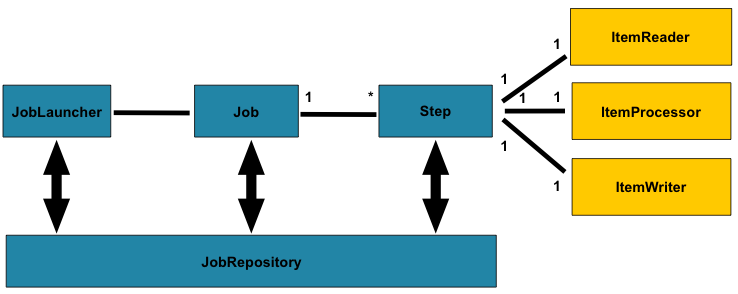
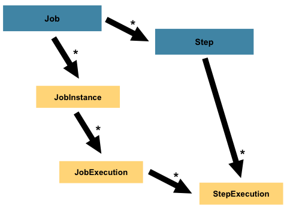

# 학습 목표
배치 어플리케이션과 이를 이루는 요소들을 이해하고, 직접 배치 어플리케이션 코드를 작성하는 방법을 익힌다.  
- [x] Spring boot batch 프로젝트 생성, 의존성 설정
- [x] Job, Step 만들어보기
- branch `simple` : Batch와 Job에 대한 기본 이해
  - [x] 10부터 1까지 1초에 한 개의 숫자를 출력하는 배치 코드 작성해보기
  - [x] job, job parameter, job execution 관계 이해하기
- branch `flow` : Step에 대한 이해 및 처리 흐름 제어
  - [ ] spring batch job flow 
  - [ ] tasklet vs chunk
  - [ ] 병렬 처리
- [ ] DB 통신하는 작업의 배치 코드 작성해보기
- [ ] 어플리케이션을 띄워두고, 특정 상황에 배치가 수행되게 해보기

> 실습 참고 자료: https://github.com/jojoldu/spring-batch-in-action  

# 학습 내용

## Spring Batch 란?

- 배치 어플리케이션을 개발할 수 있도록 설계된 경량 프레임워크.  
- 로깅/추적, 트랜잭션 관리, 작업 처리 통계, 작업 재시작/건너뛰기, 리소스 관리 등 대량의 레코드 처리에 필수적인 기능들을 제공한다.
- 최적화 및 파티셔닝 기술을 통해 대용량, 고성능 배치 작업을 가능하게 하는 기능도 제공한다.
- 따라서 단순한 배치 작업 뿐만 아니라 복잡한 대용량 배치 작업의 처리가 가능하다.
- Spring Boot는 `spring-boot-starter-batch` 의존성을 제공한다.
> 배치 어플리케이션은, 단발성의 대용량 데이터 처리 역할을 위한 어플리케이션이다.  
> Spring MVC는 개발자가 비즈니스 로직에 최대한 집중할 수 있게 해준다.  
> 이와 마찬가지로 Spring Batch는 배치 어플리케이션을 지원하는 프레임워크인 것이다. 

### Spring Boot: Job 실행하기
  - 어플리케이션 시작 시 application context에 하나의 Job이 발견되면, 'startup' 시점에 해당 Job이 실행된다.
    - `JobLauncherApplicationRunner` 클래스에서 이 내용을 확인할 수 있다.
  - 여러 개의 Job이 존재한다면, `spring.batch.job.name`에 실행시킬 Job의 이름을 명시해야 한다.
  - 배치 작업이 실행되지 않게 하려면 `spring.batch.job.enabled` 설정을 `false`로 한다.

### Spring Boot: Command Line으로 배치 인수 전달하기
- Spring Boot 어플리케이션을 CLI로 실행할 때, `--` 와 함께 인수를 전달할 수 있다. **그러나 이는 배치 Job에는 전달되지 않는다.**
  - 배치 Job에 인수를 전달하고 싶다면 `--` 없이 전달해야 한다.
    ```shell
      $ java -jar myapp.jar --server.port=7070 someParameter=someValue
    ```
    - 예를 들어 위와 같은 경우, 배치 Job에는 `someParameter=someValue`만 전달된다.

### Job Repository
- Spring Batch는 Job Repository를 위한 데이터 저장소를 필요로 한다.
- 따라서 Spring Boot로 Batch를 사용한다면, 실제 데이터베이스를 설정해야 한다. (인메모리도 가능)

> 참고 링크: https://docs.spring.io/spring-boot/docs/current/reference/html/howto.html#howto.batch

## Batch의 도메인 용어들



- `Job`: 배치 프로세스를 캡슐화하는 엔티티. 스텝을 가짐
  - Job을 이루는 것들: Job의 이름 / 여러 Step의 정의와 순서 / 재시작 여부
- `Job Instance`: 논리적인 Job 실행 개념. Job이 실행될때마다 Job Instance가 생성됨
  - Job 실행을 개별적으로 추적하기 위함.
  - `예시` 하나의 Job이 어제와 오늘 실행됐다면 JobInstance는 총 2개가 생성된다.
- `Job parameters`: Job을 시작하는 데 사용되는 매개변수 집합을 가짐
  - 실행 중인 Job의 참조 데이터, 또는 서로 다른 JobInstance를 구별할 수 있는 식별 데이터로 사용할 수 있다.
  - `예시` 하루에 한 번 실행되는 Job에 대해서, 실행 날짜가 매개변수가 된다.
  - `Job = JobInstance + 식별 파라미터`
- `JobExecution`: Job을 실행하려는 단일 시도에 대한 개념
  - 실행이 성공적으로 완료되지 않으면, 그 실행에 해당하는 JobInstance는 완료된 것으로 간주되지 않는다.
  - 실패한 JobInstance에 대해, 동일한 파라미터를 사용해 재실행하면 JobExecution은 새로 만들어지지만 JobInstance는 그대로 유지된다. 
  - `예시` 
    1. `01-01-2017` 파라미터를 가지고 Job을 실행했을 때 실패함. -> JobExecutuion, JobInstance 생성
    2. 동일한 `01-01-2017` 파라미터를 사용하여 Job을 재실행함. -> JobExecution만 새로 생성
    3. 이 때 JobInstance는 하나뿐이다.
  - 실행을 관리하는 여러 속성들을 가진다.
    - Status, startTime, endTime, exitStatus, createTime, lastUpdated, **executionContext**, failureExceptions
-----
- `Step`: 배치 Job의 독립적이고 순차적인 단계를 캡슐화하는 도메인 객체.
  - Job과 JobExecution처럼 Step도 각각 StepExecution을 가진다.
    - 
- `StepExecution`: Step이 실행될 때마다 새로운 StepExecution이 생성된다.
  - 앞의 스텝이 실패하여 실행되지 않으면, 생성되지 않는다. (해당 스텝이 실제로 시작될 때만 생성됨)
  - 각 실행은 해당하는 Step, JobExecution, 트랜잭션 관련 데이터(커밋 및 롤백 횟수, 시작 및 종료 횟수)를 참조한다.
  - 트랜잭션을 지원한다.
  - 마찬가지로 실행을 관리하기 위한 여러 속성들을 가진다.
    - Status, startTime, endTime, exitStatus, createTime, lastUpdated, **executionContext**, readCount, writeCount, commitCount, rollbackCount, readSkipCount, processSkipCount, filterCount, writeSkipCount
    - `ExecutionContext`는 배치 실행에 걸쳐 유지해야 하는 모든 데이터(통계, 상태 정보 등)를 포함한다.
-----
- `ExecutionContext`: key/value 쌍의 콜렉션으로 프레임워크에 의해 저장되고 관리되는 저장소.
  - 실습 후 공식문서 기반으로 추가 학습 필요할 듯 
- `JobRepository`: Job이 처음 실행되면, 리포지토리에서 JobExecution을 가져옴. 그리고 실행 과정에서 StepExecution과 JobExecution은 리포지토리에 전달함으로써 영속화됨.
  - `@EnableBatchProcessing` 어노테이션을 사용하면 JobRepository 컴포넌트는 자동으로 구성됨
- `JobLauncher`: JobParameters를 가지고 Job을 실행하기 위한 인터페이스.
  - 구현체는 JobRepository로부터 유효한 JobExecution을 얻어와 작업을 실행함.
-----
- `ItemReader`: 한 번에 한 항목 씩 Step에 대한 입력을 가져오는 추상체.
  - Reader가 읽어올 항목이 모두 소진되면 null을 반환.
- `ItemWriter`: 한 번에 Step, 또는 하나의 배치 또는 chunk를 출력하는 추상체.
  - 일반적으로 ItemWriter는 다음 입력에 대해 알지 못하며 현재 시점에서 전달된 항목만 알고 있음.
- `ItemProcessor`
  - 항목의 비즈니스 처리에 대한 추상체.
  - ItemReader, ItemWriter로 항목을 읽고 쓰는 동안 항목을 변형하거나 비즈니스 처리를 적용할 수 있는 액세스 포인트를 제공함.
  - 이 때 해당 아이템이 유효하지 않다고 판단하면 null을 반환해 해당 항목이 기록되지 않도록 할 수 있음.
> Reader/Writer에 대한 구체적인 내용은 공식 문서 중 아래 링크에서도 확인 가능  
> [Readers and Writers](https://docs.spring.io/spring-batch/reference/readersAndWriters.html)
-----
- `Batch NameSpace`
  - 앞서 설명된 여러 도메인 개념들은 Spring ApplicationContext 내에 구성(cofnigure)된다.
    - 여러 다른 방법이 있지만, configuration을 편하게 할 수 있도록 네임스페이스가 제공된다.
> [Configuring and Running a Job](https://docs.spring.io/spring-batch/reference/job.html)  
> [Configuring a Step](https://docs.spring.io/spring-batch/reference/step.html)  

> 참고 링크: https://docs.spring.io/spring-batch/reference/domain.html

